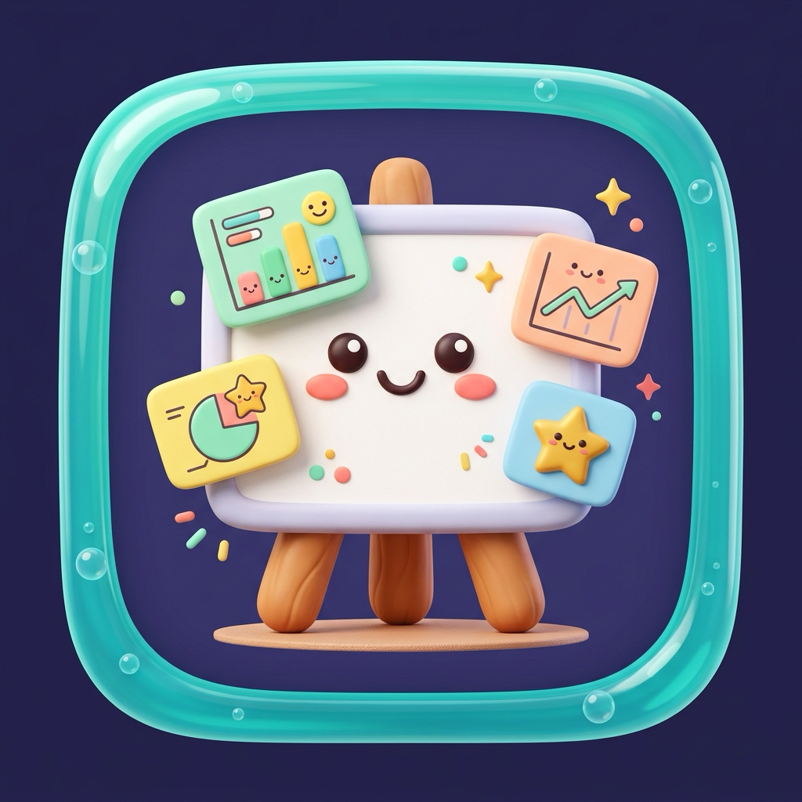

<p align="center">
  <a href="#readme"><strong>📖 README</strong></a> &nbsp;•&nbsp;
  <a href="CONTRIBUTING.md"><strong>🤝 Contributing</strong></a> &nbsp;•&nbsp;
  <a href="LICENSE"><strong>⚖️ MIT License</strong></a>
</p>

<p align="center">
  
</p>

<h1 align="center">Kids Camp Activities</h1>
<h3 align="center">Interactive Game Presentation Deck</h3>

<p align="center">
  A sleek, high-performance, full-screen interactive presentation deck crafted for camp leaders, counselors, and volunteers to present and facilitate camp games for kids with ease.
</p>

<p align="center">
  <a href="https://vitejs.dev/"></a>
  
  
  
  
  <a href="LICENSE"></a>
</p>

---

## 🌟 Highlights & Features

- **🎯 Age-Tailored Tracks**: Instantly filter and launch games tailored for **🎈 Kids (Age 3–6)** or **🚀 Older Kids (Age 7+)**, or browse all 9 activities.
- **🎨 Warm Pastel Editorial Canvas**: Clean, spacious desk aesthetic (`#fbf8f1`) featuring bespoke signature pastel color themes for every single game.
- **📸 3-Column Facilitator View**:
  1. **DIY Craft Card**: Real workshop craft photo with concise preparation details.
  2. **Gameplay Diagram**: Clear court layout diagram with straightforward 3-step rules.
  3. **Supplies & Coach Tips**: Complete materials checklist and counselor facilitation advice.
- **⏱️ Built-in Facilitator Tools**: Integrated countdown timers, fullscreen toggle, quick game rules drawer, and progress tracking.
- **⚡ Zero Sound FX Distractions**: Built strictly with zero audio dependencies so counselors can lead games without distracting sound loops or unwanted noise.
- **📱 Fully Responsive**: Optimized for large projector screens, iPads/tablets, and mobile counselor phones.

---

## 🎮 Game Catalog

### 🎈 Kids Track (Age 3–6)
*Gentle motor coordination, safe obstacle navigation, cooperative relay, and counselor support.*

| # | Game Title | Theme & Focus | Signature Pastel |
|---|---|---|---|
| **01** | **Goliath SlingShot** | Balloon-cup launcher target practice into giant box | Meadow Pistachio (`#f4f9ec`) |
| **02** | **Feed Goliath Game** | Ball-toss feeding challenge into Goliath's mouth | Warm Peach (`#fef5f0`) |
| **03** | **David's Valley Bench Dash** | Low-bench balance beam crawl & stone rescue relay | Sunny Honey (`#fdfbf0`) |
| **04** | **Goliath's Footprint Stomp & Toss** | Big-step footprint agility course & beanbag landing | Blossom Blush (`#fdf2f4`) |
| **05** | **David & Goliath Puzzle Race** | Cooperative floor puzzle assembly relay sprint | Royal Periwinkle (`#f4f6fe`) |

### 🚀 Older Kids Track (Age 7+)
*Speed, precision aiming, dual-string balance coordination, and strategic team play.*

| # | Game Title | Theme & Focus | Signature Pastel |
|---|---|---|---|
| **06** | **Reaction Ball & Cup Game** | Fast reflexes, ping-pong bounce catching duel | Powder Sky Blue (`#f0f6fc`) |
| **07** | **David & Goliath Sliding Game** | Dual-string pulley steering & precision ring drop | Dreamy Lilac (`#f6f1fc`) |
| **08** | **Brook of Elah River Crossing** | Stepping stone floor balance & river sprint | Lagoon Aqua (`#f0faf8`) |
| **09** | **The Wind of Elah** | Handheld fan wind race herding ping-pong "sheep" | Papaya Breeze (`#fff7f0`) |

---

## 🎨 Design System

All visual components adhere to our minimal editorial design rules:
- **Palette**: Warm pastel desk canvas (`#fbf8f1` / `#fcf9f2`) with soft ambient glows.
- **Typography**: `Outfit` for bold modern headings, `Plus Jakarta Sans` for body copy, and `JetBrains Mono` for badges and metadata.
- **Top Pill Header**: Category indicator on left, zero-padded slide number (`01`–`09`) in the center, and camp date badge on right.

---

## ⌨️ Facilitator Keyboard Shortcuts

| Key | Action |
|---|---|
| `Space` / `→` / `N` | Advance to next slide |
| `←` / `P` | Go back to previous slide |
| `H` | Return to Launchpad / Home view |
| `R` | Open Game Rules sheet modal |
| `O` / `Esc` | Toggle Slide Drawer overview |
| `F` | Toggle Fullscreen mode |

---

## 🚀 Quick Start & Development

### Prerequisites
- Node.js (v18 or higher recommended)
- npm or pnpm

### Installation
```bash
# Clone the repository
git clone https://github.com/desmondlee95700/presentation_web.git

# Navigate to project directory
cd presentation_web

# Install dependencies
npm install

# Start local dev server
npm run dev
```
Open [http://localhost:5173](http://localhost:5173) in your browser.

### Production Build
```bash
# Build optimized bundle
npm run build

# Preview production build locally
npm run preview
```

---

## 📁 Project Structure

```
presentation_web/
├── public/
│   ├── app-icon.png               # High-res presentation app icon
│   ├── favicon.png                # Browser favicon
│   ├── favicon-32x32.png          # 32x32 favicon
│   ├── apple-touch-icon.png       # Apple touch icon
│   └── images/                    # Game craft photos & diagrams
├── src/
│   ├── presentation/
│   │   ├── gamesData.js           # 9 Camp games content & metadata
│   │   └── slideDeck.js           # Fullscreen slide rendering & controls
│   ├── ui/
│   │   ├── controlsDock.js        # Floating bottom dock & overview drawer
│   │   └── landingPage.js         # Interactive launchpad & track filters
│   ├── main.js                    # Application entry point & routing
│   └── style.css                  # Design system styles & animations
├── index.html                     # HTML5 shell with web icon links
├── CONTRIBUTING.md                 # Contribution guidelines
├── LICENSE                        # MIT License
├── package.json
└── vite.config.js
```

---

## 🤝 Contributing

Contributions, game suggestions, and improvements are always welcome! Please check out [CONTRIBUTING.md](CONTRIBUTING.md) for details on guidelines and our pull request process.

---

## ⚖️ License

This project is licensed under the [MIT License](LICENSE) — see the [LICENSE](LICENSE) file for details.
